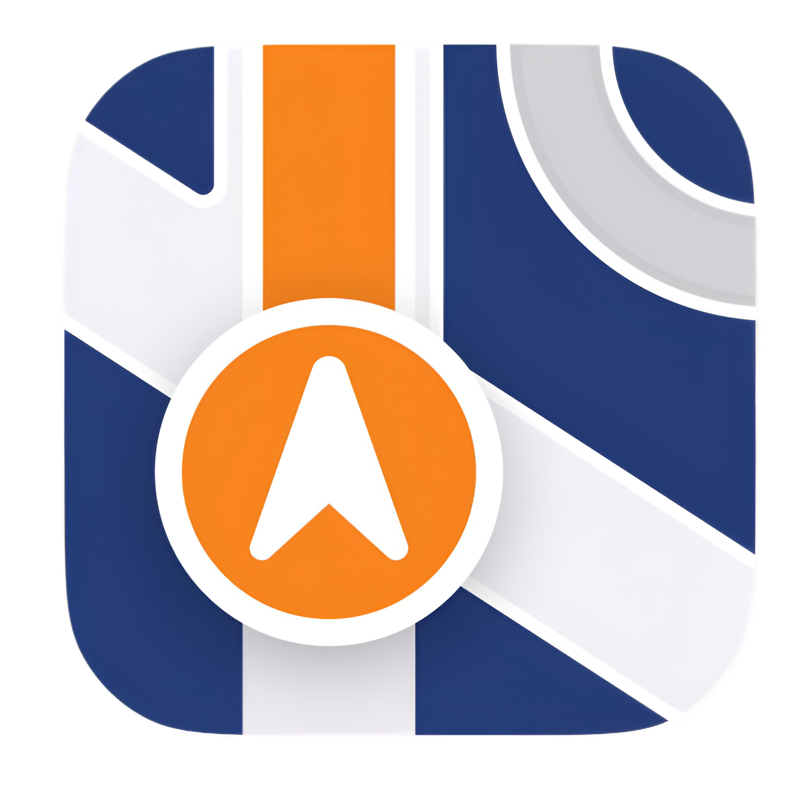

# PESUNav Hub

**Smart Campus Navigation & Student Companion Platform**

---

---

## Overview

PESUNav Hub is an innovative web application designed for students to efficiently navigate their campus, manage schedules, and connect with peers using rich geolocation features, interactive mapping, and collaborative tools. The project is built using the MERN stack with a modern Vite-powered React frontend and a robust Node.js/Express/MongoDB backend.

---

## Features

- Interactive campus map with route guidance
- Smart class scheduler and reminders
- Real-time study space and event finder
- Secure login and registration system
- Responsive design (optimized for MacBook Air & desktops)
- Stylish custom theme: Open Sans font, Purple & Green color palette
- Custom layered CSS logo

---

## Tech Stack

- **Frontend:** React (Vite), JavaScript, Axios, React Router, Open Sans font, custom responsive CSS
- **Backend:** Node.js, Express, MongoDB, Mongoose, bcryptjs
- **Design:** Figma wireframes, CSS custom properties
- **API Integration:** Ready for Maps/Geolocation APIs

---

## Getting Started

### Prerequisites

- Node.js (LTS recommended)
- npm
- MongoDB instance (local or MongoDB Atlas)
- Git